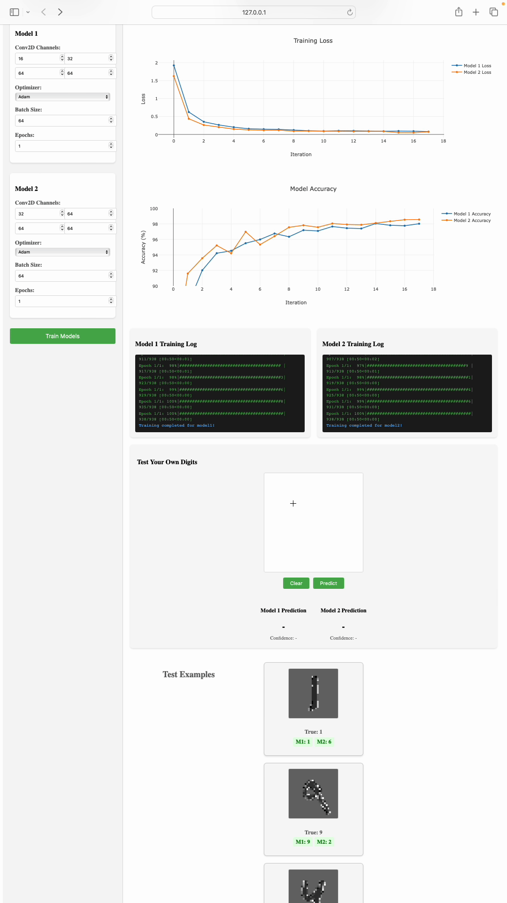

# MNIST CNN Training Playground

An interactive web application for experimenting with and comparing different CNN architectures on the MNIST dataset. Train and visualize two CNN models simultaneously with customizable architectures and hyperparameters.



## Features

### Model Configuration
- Configure two CNN models side by side
- Customize Conv2D channel sizes for all 4 layers
- Choose from popular optimizers (Adam, SGD, RMSprop)
- Adjust batch size and number of epochs
- MPS (Metal Performance Shaders) acceleration support

### Real-time Visualization
- Live training loss curves
- Accuracy tracking (focused on 90-100% range)
- TQDM-style progress bars
- Live training logs for both models
- Side-by-side model comparison

### Results Analysis
- Compare model performances in real-time
- View predictions on same test images
- Color-coded correct/incorrect predictions
- Interactive charts with Plotly.js
- Draw your own digits and test both models in real-time
- Confidence scores for predictions

## Tech Stack
- Backend: Python, Flask, PyTorch
- Frontend: HTML5, CSS3, JavaScript
- Visualization: Plotly.js
- Dataset: MNIST

## Quick Start

1. Clone the repository:
```bash
git clone https://github.com/yourusername/mnist-cnn-playground.git
cd mnist-cnn-playground
```

2. Create and activate virtual environment:
```bash
python -m venv venv
source venv/bin/activate  # On Windows: venv\Scripts\activate
```

3. Install dependencies:
```bash
pip install torch torchvision flask numpy tqdm
```

4. Start the application:
```bash
python server.py
```

5. Open in browser:
```
http://localhost:5000
```

## Usage

1. Configure both models using the left panel controls
2. Click "Train Models" to start training
3. Watch real-time training progress and metrics
4. Compare model performances and predictions
5. Experiment with different architectures and hyperparameters

## Requirements
- Python 3.8+
- PyTorch
- Flask
- torchvision
- tqdm
- numpy

## TODO: Future Enhancements

### Dataset Management
- [ ] Add support for multiple built-in datasets (MNIST, FashionMNIST, CIFAR-10, etc.)
- [ ] Allow custom dataset upload with validation
- [ ] Add dataset preview and statistics visualization
- [ ] Support for dynamic number of classes
- [ ] Dataset preprocessing options (normalization, augmentation)

### Network Architecture
- [ ] Dynamic network architecture builder in UI
  - [ ] Layer-by-layer network definition
  - [ ] Real-time validation of layer compatibility
  - [ ] Visual representation of network architecture
  - [ ] Common architecture templates/presets
- [ ] Support for different layer types:
  - [ ] Convolution (with padding, stride options)
  - [ ] Pooling
  - [ ] Batch Normalization
  - [ ] Dropout
  - [ ] Linear/Dense
  - [ ] Activation functions

### Training Configuration
- [ ] Advanced hyperparameter settings
  - [ ] Learning rate schedules
  - [ ] Custom optimizer configurations
  - [ ] Loss function selection
- [ ] Cross-validation support
- [ ] Early stopping criteria
- [ ] Model checkpointing

### Analysis and Reporting
- [ ] Automated training report generation
  - [ ] Model architecture summary
  - [ ] Training hyperparameters
  - [ ] Performance metrics and graphs
  - [ ] Example predictions
  - [ ] Resource utilization stats
- [ ] Export trained models
- [ ] Confusion matrix visualization
- [ ] Layer activation visualization
- [ ] Model comparison history

### UI/UX Improvements
- [ ] Drag-and-drop network architecture builder
- [ ] Interactive architecture visualization
- [ ] Advanced chart customization
- [ ] Dark/Light theme support
- [ ] Responsive design for mobile devices

### Backend Enhancements
- [ ] Model persistence and loading
- [ ] Multi-GPU support
- [ ] Distributed training capability
- [ ] API documentation
- [ ] Containerization support

## TODO: Beginner-Friendly Features

### Interactive Network Visualization
- [ ] Real-time network architecture visualization
  - [ ] Animated data flow through layers during training
  - [ ] Color intensity showing activation strengths
  - [ ] Hover tooltips explaining each layer's function
  - [ ] Visual representation of filter sizes and strides

### Learning Resources
- [ ] Interactive tutorials
  - [ ] Guided walkthrough for first-time users
  - [ ] Tooltips explaining each parameter's role
  - [ ] Recommended parameter ranges for beginners
  - [ ] Common pitfalls and how to avoid them

### Visual Explanations
- [ ] Feature map visualization
  - [ ] Show what each conv layer is detecting
  - [ ] Highlight activated regions on input images
  - [ ] Compare feature maps between models
- [ ] Gradient flow visualization
  - [ ] Show which parts of network are learning
  - [ ] Identify vanishing/exploding gradients

### Model Understanding
- [ ] Parameter impact analysis
  - [ ] A/B testing of different parameters
  - [ ] Visual comparison of learning rates
  - [ ] Impact of batch size on training
  - [ ] Effect of different optimizers
- [ ] Common architecture templates
  - [ ] Pre-configured successful architectures
  - [ ] Comparative analysis of different architectures
  - [ ] Explanation of when to use what

### Interactive Predictions
- [ ] Failure analysis dashboard
  - [ ] Show where models commonly make mistakes
  - [ ] Compare confusion matrices
  - [ ] Suggest improvements based on errors

### Performance Insights
- [ ] Resource utilization metrics
  - [ ] Memory usage per layer
  - [ ] Computation time breakdown
  - [ ] Parameter count visualization
- [ ] Model complexity analysis
  - [ ] FLOPs calculation
  - [ ] Parameter efficiency metrics
  - [ ] Inference time comparison

### Experimentation Tools
- [ ] Hyperparameter playground
  - [ ] Interactive parameter tuning
  - [ ] Real-time impact visualization
  - [ ] Suggested optimization strategies
- [ ] Data augmentation explorer
  - [ ] Visual effects of different augmentations
  - [ ] Impact on model performance
  - [ ] Best practices recommendations

### Collaborative Features
- [ ] Model sharing
  - [ ] Share configurations via URLs
  - [ ] Export/import model architectures
  - [ ] Community-contributed examples
- [ ] Performance benchmarking
  - [ ] Compare with community results
  - [ ] Leaderboard for different metrics
  - [ ] Share insights and tips

### Documentation and Help
- [ ] Interactive glossary
  - [ ] AI/ML terms explained simply
  - [ ] Visual examples for concepts
  - [ ] Links to detailed resources
- [ ] Troubleshooting guide
  - [ ] Common issues and solutions
  - [ ] Performance improvement tips
  - [ ] Best practices

These features focus on:
1. Visual learning and understanding
2. Interactive experimentation
3. Immediate feedback
4. Practical insights
5. Community learning
6. Beginner-friendly explanations

The goal is to make deep learning concepts more accessible and understandable through hands-on experimentation and visual feedback.

## License
MIT

## Contributing
Pull requests are welcome. For major changes, please open an issue first to discuss what you would like to change. 